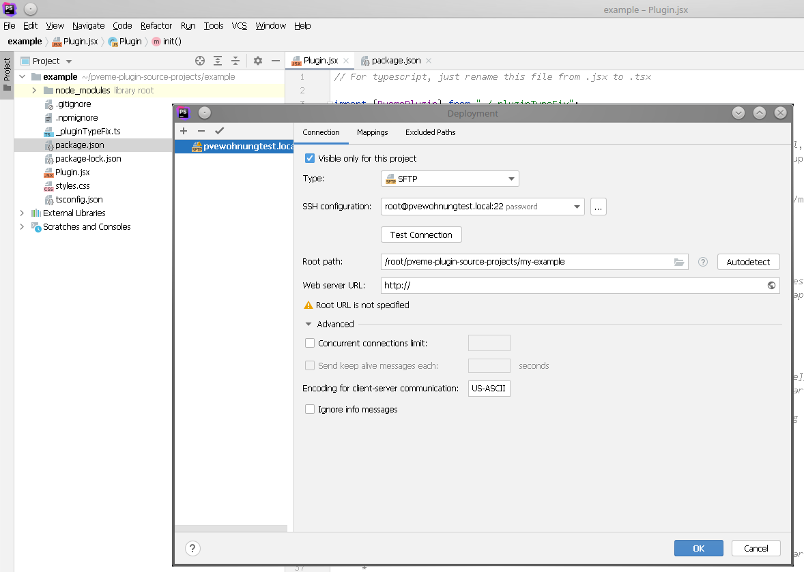
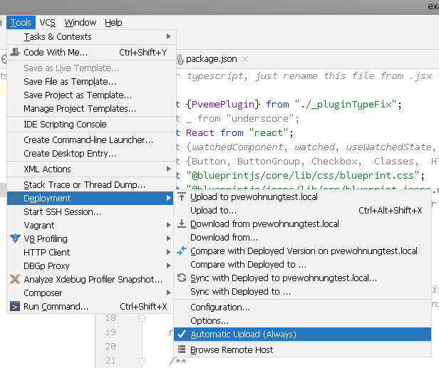
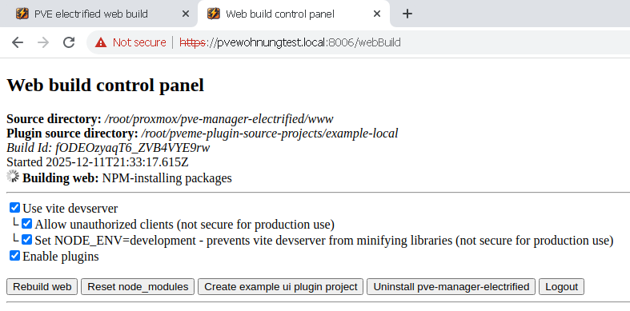
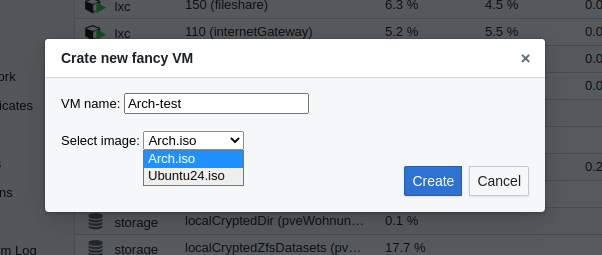

# Setting up your plugin project
- Download the [example plugin project](https://pve-electrified.net/ui-plugin-example.zip) and extract the files.
- Open the project in your favourite IDE (Webstorm recommended) and set it up to **rsync** your project files to `/root/pveme-plugin-source-projects/[plugin-name]`.
  - <details> <summary>It should look like this (screenshots)</summary>
  
    
    

  </details>
  
  - Exclude the `node_modules` folder
  -  Under Options, set "delete remote files when locals are deleted".
- For **types** in your IDE, run `npm install --ignore-scripts`. This installs the **types** and dependencies for the pve-manager-electrified base. So you have the full set of the server library's types "mirrored" in your IDE👍.
- Navigate to `/webBuild `in your browser. It will display the web build control panel.
It should show a "**Plugin source directory**" with your project.    

  
- Check "Use vite devserver" and "Set NODE_ENV=...". This will give you hot reloading and source maps👍.

When `package.json` is changed, it will automatically rebuild the web and install all new dependencies👍.   
Now, explore [Plugin.jsx](https://github.com/bogeeee/pve-manager-electrified/blob/main/ui-plugin-example/Plugin.jsx) and happy coding!

# API

The api is documented **in jsdoc only**. Use your IDE's code completion / intellisense. You can also explore it via [the stackblitz IDE in the browser](https://stackblitz.com/fork/github/bogeeee/pve-manager-electrified/tree/main/ui-plugin-example?title=Electrified%2plugin&file=Plugin.jsx). 

Here are some picked api methods, to give you an orientation:

| Symbol | Description | Example |
| -------- | -------- | ------- |
| `Application#datacenter` | Entry to the **model**. Everything under there is [watchable](https://github.com/bogeeee/react-deepwatch?tab=readme-ov-file#watched); If resources (i.e. content of files on the host) must be loaded in an async way, [retsync](https://github.com/bogeeee/proxy-facades/blob/main/retsync.ts) code is used. | ```` this.app.datacenter.nodes[0].getGuest(280).maxmem ```` |
| `Application#currentNode` | Node on which you're browing the web ui | `this.app.currentNode` |
| `Node#execCommand` | This will be your friend:) Exec any shell command and return the result. | ```` console.log(await this.app.currentNode.execCommand`ls -l /etc/pve` ````)
| `Node#api2fetch` | Call PVE's [http api](https://pve.proxmox.com/pve-docs/api-viewer) | `await this.app.currentNode.api2fetch("POST", "/lxc/820/status/stop", {skiplock: true});` |
| `Node#getFile` | Get any file/dir on the host. [Retsync](https://github.com/bogeeee/proxy-facades/blob/main/retsync.ts). | `this.app.currentNode.getFile("/etc/hosts").content` |
| `File#onChange` | You can also **watch** files and dirs for changes | |
| `Appliction.util...` | Util functions
| `Application.classes...` | Useful for `instanceof` checking | 
| `Application.classes.model...` | Useful for `instanceof` checking | `if(guest instanceof this.app.classes.model.Qemu) { ...do some qemu specific stuff... }` | 
| **UI** |
| `Appliction.util.ui...` | UI util functions | |
| `Appliction.util.ui.showBlueprintDialog` | Shows a popup dialog where you can specify the content | See [Quick guide to creating dialogs with react](#quick-guide-to-creating-dialogs-with-react) |
| `Application.util.spawnWithErrorHandling` | Use in event handlers, to properly display errors when something goes wrong | ```` <button onclick={ () => this.app.util.spawnWithErrorHandling( async() => {...my code...} ) }/>````|
| t | Translates text into the current ui language | ```` t`You have ${unreadMsgs.length} unread messages` ```` | 

# Quick guide to creating dialogs with react

Here's a quick and practical guide, because we want to spare you reading all the [100s pages of very chatty React documentation](https://18.react.dev/).

## Example Dialog:



Here's the code for it:

````javascript
import {Button, ButtonGroup} from "@blueprintjs/core"; // Import these components from the blueprint component libraries

export default class Plugin extends PvemePlugin {
  // ...
  async init() {

    const dialogResult = await this.app.util.ui.showBlueprintDialog({title: t`Crate new fancy VM`}, (props) => {
      const state = useWatchedState({
        vmName: "", // Initial value
        isoFile: "", // Initial value
      });
      return <div>
        <div className={Classes.DIALOG_BODY}>
          {t`VM name`}:
          <input type="text" {...bind(state.vmName)}/>
          <br/>
          <br/>
          {t`Select image`}:
          <select {...bind(state.isoFile)}>
            {load(async () => await this.app.currentNode.execCommand`ls /rpool/pveDir/template/iso/`)
                    .split(/\s+/).map(file => <option key={file} value={file}>{file}</option>)}
          </select>          
        </div>
        <div className={Classes.DIALOG_FOOTER}>
          <div className={Classes.DIALOG_FOOTER_ACTIONS}>            
            <ButtonGroup>
              <Button onClick={() => props.resolve(state)} intent={Intent.PRIMARY}>{t`Create`}</Button>
              <Button onClick={() => props.resolve(undefined)}>{t`Cancel`}</Button>
            </ButtonGroup>
          </div>
        </div>
      </div>;
    });

    if (dialogResult) {
      console.log(`Result: vmName: ${dialogResult.vmName}, isoFile: ${dialogResult.isoFile}`)
      // ... Do something with dialogResult.vmName and dialogResult.isoFile
    }

  }
}
````

Note: For a better look, use Blueprint's `<InputGroup>` rather than `<input type="text">` and `<HTMLSelect>` than `<select>`.

The following 4 sub-chapters explain the code, which you saw in the example:

## Quick concept of React + react-deepwatch: 
What you see as the second parameter to `showBlueprintDialog`, is a render function: `(props) => {...}`. 
Such a function's rendered output is fully-derived-from- / fully-represented-by the state. Upon interactivity (i.e. after a button click.), you never change ui elements directly but instead change the state. 
Changing the state automatically re-renders the component👍.  
I.e:`<a onClick={() => state.vmName=""}>Reset</a>` would output a "Reset" link that clears the "VM Name" input field.   
You can, in theory, also watch any external object and kind of use it as state. It does not have to be under `useWatchedState`. Wrap it in `watched(the_external_object)` then.

## JSX syntax
The above example uses JSX syntax.
- JSX files are javascript files, with the addition of **allowing `<Element/>`s inside the code**, as variables, parameters or return values.
- **Attributes of elements** can be specified like in html as `<div attr="abc" />` or with js expressions: `<div attr={} />`
  - The **Css class-name** attribute is `className` instead of `class`. Example: `<div className="content-section highlighted"/>`
  - For inline **css styles**, use a slightly different syntax and note, that properties are written in camelCase instead of kebab-case. Example: `<div style={{backgroundColor: "#FF00000"", opacoty: 0.8}}></div>`
- `{js-expression}` outputs string content (html escaped) or if the js-expression returns a React component, then such will be inserted.   
  A `{undefined}`  / returning undefined will be ignored. This is handy for, see next:
- **`If` and `for` in output**: As you usually have long `return` statements and you can't insert `if` conditions or `for` loops there, the trick is, to use
    - `{ condition?myOutputValue:undefined }` for `if` and
    -  `{ myArray.map(entry => <div>{...do something with the entry...}</div>) }` to do looping.
- **Mutiple elements**: Every time, you output **multiple** elements, like i.e. in the above for loop. You must specify a `key={...}`, so React can re-identify the element. React warns you in the console otherwise.  
  _You might think: "Why does it need to bother me with that?". Think about, when the element is/has a child component **with state**. It can then keep the state for you, and the child component does not reset each render, which you should be very thankful of this essential feature;)_

## 3rd party components
- Besides normal html elements like `<div/>`, You can also insert **components**. Those begin with a big letter. I.e. `<ButtonGroup/>`. The syntax is the same as with normal html elements:)
- To use any React component library. Add it to the `dependencies` in the `package.json` and it will be automatically installed. Add the `import`s like in the example / the top of `Plugin.jsx`.
- Here are the 2 popular, already imported, component libraries: [Blueprint](https://blueprintjs.com/docs/#core) and [Material UI](https://mui.com/material-ui/all-components/)


## React-deepwatch specific functions

- Use the `{...bind(state.myProperty)}` syntax to bind the value of an input element to some value in the state. Or to any property deep inside your watched model. It will be life-updated in both directions.
- For calling **async** functions in the middle of your component's render code, use `load(async () => { ... your async code... }, {/* LoadOptions (optional) */})`. [Docs](https://github.com/bogeeee/react-deepwatch?tab=readme-ov-file#and-less-loading-code).    

[React Depwatch](https://github.com/bogeeee/react-deepwatch)

# Retsync
Some methods are [retsync](https://github.com/bogeeee/proxy-facades/blob/main/retsync.ts). Meaning, it's **sync** code that does operations that normally would require **async**. So you will have to wrap it like in this example (or you'll get an error which tells you exactly to do so):
````javascript
    await retsync2promise(() => {
            this.app.currentNode.getFile("/etc/hosts").content;
    });
````
You can use retsync functions in watchedcomponents without wrapping them👍.

# Modding classic pve code
In case you don't find a plugin hook for the feature, you want to code on, create an [issue](https://github.com/bogeeee/pve-manager-electrified/issues) or otherwise, if you're impatient, dig your self into the clasic code:

### Directly editing the classic sources
During development, it might be handy to directly edit the sources, to find the spot that you want to patch or hook into.
On the host, do:
````bash
mkdir /root/proxmox
cd /root/proxmox
git clone https://github.com/bogeeee/pve-manager-electrified
systemctl restart pvenodejsserver
````
Note: Make sure, the versions of the running server and the client code match, so eventually `git checkout` a few commits back to the last release commit.  
Now, under `/root/proxmox/pve-manager-electrified/www` you have all sources and editing them **hot-reloads** the page👍.

### Modding/Patching
After you've found the desired spot and want to deliver a patch via your plugin, override the `Plugin#earlyInit` method. Example:
````js
export default class Plugin extends PvemePlugin {
    /**
     * Called, when classic components have been defined but are not started yet.
     * Use this hook, to modify them.
     * <p>
     *     this.app has not been fully initialized at that time.
     * </p>
     * @see init
     */
    async earlyInit() {
        const mePlugin = this;
        
        // Patch the PVE.Workspace#initComponent method: 
        const orig_initComponent = PVE.Workspace.prototype.initComponent;
        Ext.define('MyPlugin.PVE.Workspace', {
            override: 'PVE.Workspace', // **Patches** PVE.Workspace's definition
            initComponent(...args) {
              console.log("Hello from patched initComponent");
              
              mePlugin.app... // Access this plugin or the electrifiedApp from here.
              
              return orig_initComponent.apply(this, args); // Calls the original.
            }
        });
    }
}
````

Note: The Ext JS's `callParent` does not work from module code. Instead, use: `this.prototype.apply(this, [...args])`. This calls it at the level of the parent of the overridden. 
You can't call the overridden level its self, because that method was destroyed by patching with "override". Therefore, save a reference to it beforehand, like in the above example.

[Ext JS 6 documentation](https://docs.sencha.com/extjs/6.7.0/modern/Ext.html)

# Bridging to React
See JsDoc of `app.util.ui.ReactComponent` to insert react components into Ext JS components.

# Publish your plugin
Plugins are delivered as npm packages. The name must start with `pveme-ui-plugin-`.
See also the description in package.json/###publish_to_npm:###.  
You'll need to set up an [npm account](https://www.npmjs.com) with "2 factor auth", which means: webauthn/passkeys (just this one factor from npm's perspective). If you have no hardware passkey, you can use the Bitwarden browser plugin instead.  
Then run:
````
npm run publish_to_npm:login
npm run publish_to_npm:publish
````