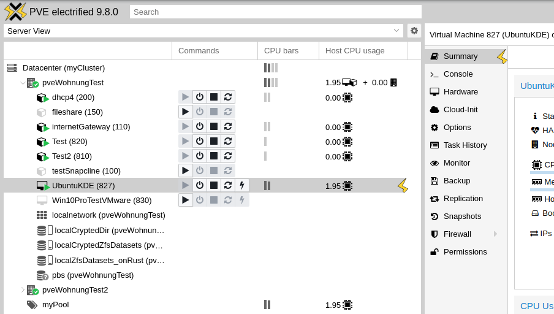
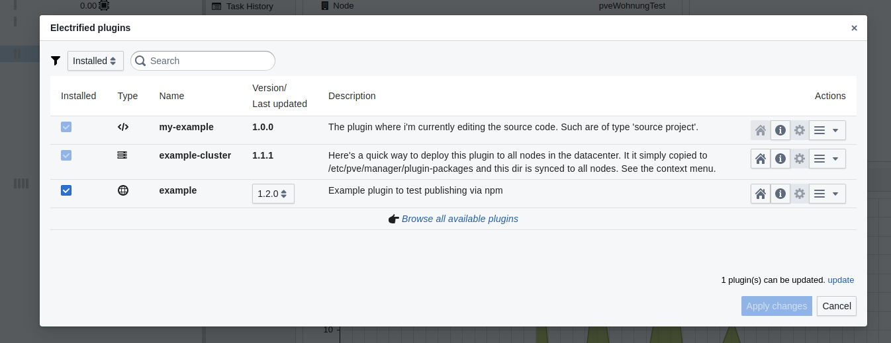

# PVE electrified

This is a modification of the [Proxmox Virtual Environment](https://www.proxmox.com/en/products/proxmox-virtual-environment/overview) **user interface**, that brings some nice features, mainly for homelab'ers.
PVE electrified is **independant** of the company Proxmox. Also, it adds a plugin system and lifts PVE to a very developer friendly architecture, because in the past it was so hard for developers to enhance the PVE UI that almost no community mods existed.

<details>
<summary>Motivation</summary>

Since years, i have been an enthusiastic user of my PVE home-lab and semi-professional environment, meaning, using it as infrastructure for my development machines for my job as a freelancer. 
Back in the days, i was experimenting with different linux distos and software stacks and always needed a feature to quickly jump between snapshots or fork from them to test things out.
Cloning vms took longer and more disk space than my attention span and storages offered. So i wondered why there is no good way to quickly make copy-on-write clones (inspired/a bit similar to what the "templates" feature offered, but which had its own limitations and misconceptions imho).
So i thought: why not modify the PVE gui, since it's open source. But then i realized that there were super many stones in the way to get a proper development environment.
I.e. the javascript is delivered as a >20k of lines bigfile, hardly debuggable and for a round trip, you had to run minute long make targets. Not fun at all!
So i decided to improve all this and port it to a modern environment with vite, React, typescript on the server and client side. 
Development took some time: Starting in 2022 and besides having to deal with my normal contract work, and it went a bit off the road cause i realized, that no proper RPC existed for Node.js, like i was used to, with Direct-Web-Remoting in my java days. Therefore, as a side project, [Restfuncs](https://github.com/bogeeee/restfuncs) was born. And then the next backing side project was born: [React deepwatch](https://github.com/bogeeee/react-deepwatch).
And on the way came many other ideas like the cpu bars and a plugin system and, see [the planned features](#features).  
Also, open source does not develop it's self. Developers need motivation, so write me, if you like it and also i'll be setting um something for financial motivation (donations) which would allow me to put more time into it because currently, i have to go back to focus on contract-work for my earnings. 
</details>


# Features
- **CPU usage bars** in the tree. Updated in realtime.[^1]  
    
  [^1]: Realtime = 1 second interval. As this comes with some cost, on systems with many lxcs, the interval will increase automatically.
- **A plugin system** that allows to easily [create and publish UI plugins](https://github.com/bogeeee/pve-manager-electrified/blob/main/docs/plugin-development.md).  
  
- PLANNED: Show real thin **disk usage** in the tree.
- PLANNED: **Instant cloning** of guests. Uses ZFS's copy-on write feature. Allows cloning of snapshots, so you can have a quick peak into an older state of your vm. Also allows cloning with RAM. There is an improved dialog for a faster workflow. _These mentioned clone features work with ZFS only_.
- PLANNED: **Docker support**.
- PLANNED: **Assistants for several small optimizations for home-lab usage:** Gpu passthrough; Dynamic ip; Prevent ssd wear-down; Install microcode update packages; Fix zfs memory settings; Fix disk stalling; Warn on simultaneous USB device use; Show password prompts for encrypted disks;

_Features are developed for **home-lab users first**. That's the most reasonable to focus on as a free-time open source developer. If you need features refined for enterprise grade (i.e. working with non-admin permissions), you still have the option [to pay me working on them](mailto:bogeee@bogitech.de)._

## Install
Requires PVE 9.x or later.
````
wget https://pve-electrified.net/pubkey.asc -O /etc/apt/trusted.gpg.d/pve-electrified.asc && \
apt install -y lsb-release && \
echo "deb https://pve-electrified.net/debian $(lsb_release -c -s) main" >> /etc/apt/sources.list
apt update
apt install -y pve-manager-electrified
````

## Uninstall

````
apt install -y pve-manager-electrified- pve-manager+
````


# Behind the scenes / architecture
These are the differences to the original pve-manager package from Proxmox: These are mainly intended, to improve the developer experience.

- Backend:
  Pve-manager-electrified starts a nodejs webserver, which is written in Typescript, so we have more modern language
  here than Perl. This webserver (port 8006) proxies some of the http and websocket paths, like to `/pve2`, `/novnc`, `/xtermjs`
  , `pwt`, `/api2` to the original pve backend server (called pveproxy)
  which is also/still running but was just moved to a different (internal) port: 8005.
- Frontend:
  Each time, when started, the nodejs webserver uses **vite**, to bundle the web files. This way, we can have the most modern web
  techniques like React, Typescript, npm dependency management and fast reloading during development (during dev, it starts a vite devserver). The old original
  .js files are also served. But instead of all in a non-debugging-friendly bigfile, they are listed as individual (Vite can still bundle them internally but then we have proper source mapping).
  React components are used in the mix with the old ExtJS 6 components.  
  Vite can also run in **dev server** mode. Then it watches the files and gives you fast reloading. Under `/webBuild`, There's control panel, where you can switch modes.

# Security consideration when using it in an enterprise
Read [here](https://github.com/bogeeee/pve-manager-electrified/blob/main/docs/security.md)

# Plugin development guide
See [here](https://github.com/bogeeee/pve-manager-electrified/blob/main/docs/plugin-development.md)
  
# Source code / license

[Source code on Github](https://github.com/bogeeee/pve-manager-electrified)  
[License](https://github.com/bogeeee/pve-manager-electrified/blob/main/debian/copyright). It meets GNU Affero General Public License, GPL and MIT. So it's luckily allowed to modify and republish the Proxmox's packages👍.  
[contact me](mailto:bogeee@bogitech.de)

# 100% hand coded
Electrified code is 100% hand coded with passion ❤, by an experienced software developer
Contact me, if you need  features or if you have freelancer work to give out (in the EU, german / english speaking).